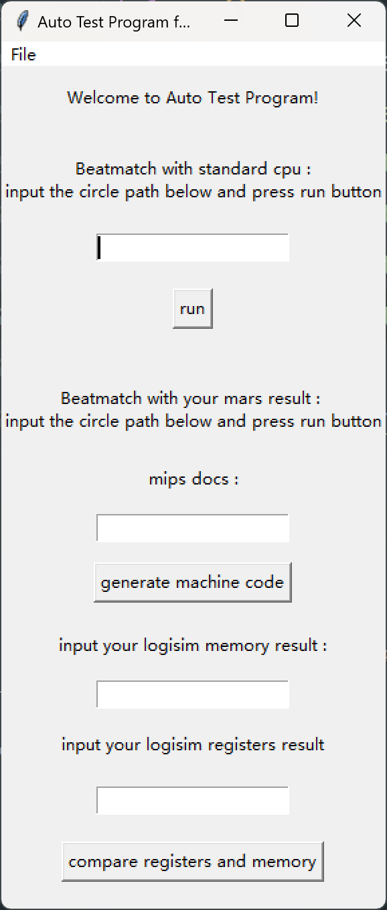

# README

> `git`仓库:[meteor041/P3-auto-test: an auto test program for P3 in CO](https://github.com/meteor041/P3-auto-test)

## 用途

> `autoGenerate.py`:自动生成`asm`测试文件
>
> `autoRun.py`: 自动运行`asm`文件,生成机器码文件,内存文件,并输出寄存器内容
>
> `compareMemory.py`: 针对`MIPS`中Data Segment的导出文件与`Logisim`中RAM的Memory导出文件的比较程序
>
> `compareRegister.py`:针对`MIPS`中寄存器记录文件与`Logisim`中寄存器的日志文件的比较程序
>
> `logisimRun.py`:利用测试电路运行待测电路,生成检测结果
>
> `gui.py`:创建图形化界面

## 使用方式

> 按照下列步骤操作

### 一 、启动图形化界面

```bash
#启动图形化界面
python gui.py
```



### 二、与标准电路对拍

> 标准电路文件为`standard_cpu/cpu.circ`,测试电路文件为`standard_cpu/cpu_test.circ`
>
> 在图形化界面中输入测试电路的绝对路径,点击`run`按钮
>
> 生成检测结果到`result/beat_match_result.circ`

### 三、与MARS对拍

> 1. 输入MIPS文件,点击`generate machine code`按钮
> 2. 将`docs/machine_code.txt`通过`load image`方式导入logisim中的RAM
> 3. 在`Logisim`中生成CPU寄存器日志文件
> 4. 在`Logisim`中导出RAM的Memory文件
> 5. 在图形化界面中输入CPU寄存器日志文件和Memory文件的绝对路径,点击`compare registers and memory`按钮
> 6. 检测结果位于`result/beat_match_result.txt`
